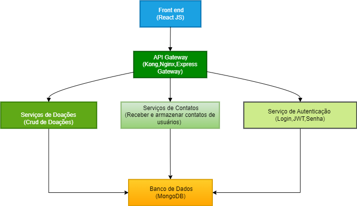

# Cidade Sem Poluição - Microsserviços

## Sobre o projeto

O "Cidade Sem Poluição - Microsserviços" é um conjunto de API's desenvolvidas em Node.js que atua como o backend da nosssa aplicação.

### O que é o projeto Cidade Sem Poluição?

O propósito é ajudar alguns moradores e trabalhadores do bairro Farias Brito a identificar os tipos de poluição e como lidam com ela, bem como demonstrar a maneira certa de descartar o lixo. Objetivos do documento: apresentar aos entrevistados uma aplicação, dentro do contexto apresentado relacionado aos problemas envolvendo o lixo e a poluição, desenvolvida pela equipe.

### Público alvo do projeto
O público-alvo do projeto é constituído por alguns moradores e trabalhadores do bairro Farias Brito, mas especificamente das ruas Bela Cruz e Dom Jerônimo e da Travessa Nossa Senhora das Graças.

### Resultado esperado e impacto social
É esperado que o projeto desenvolvido pela equipe leve algum impacto positivo para o público-alvo, bem como a conscientização a respeito dos diferentes tipos de poluição e de como descartar o lixo corretamente.

>  ℹ Quer saber mais?
>
> Este repositório é um dos componentes da nossa aplicação. Para conhecer os outros repositórios do projeto, acesse os seguintes links:
> - [cidade-sem-poluicao-api-gateway](https://github.com/kassiosilva/cidade-sem-poluicao-api-gateway)
> - [cidade-sem-poluicao-front](https://github.com/kassiosilva/cidade-sem-poluicao-front)
## Visão geral da arquitetura

 

>  ⚠ Atenção
>
> Sabemos que não é uma boa prática manter um banco de dados compartilhado para todos os microsserviços, mas devido ao custo dos serviços de hospedagem fora dos planos free achamos melhor manter só um banco mongodb.

### Como funciona?
O cliente(frontend) faz a request para a api gateway e ela fica responsável por encaminhar para o seu respectivo microsserviço que devolve a response para a api gateway e ela fica responsável de passar para o frontend.

Toda a comunicação é feita via http request. Estamos utilizando o banco de dados *MongoDB* para persistir os dados dos usuários.

*Repositórios dos outros components no Github*:
* [cidade-sem-poluicao-api-gateway](https://github.com/kassiosilva/cidade-sem-poluicao-api-gateway)
* [cidade-sem-poluicao-front](https://github.com/kassiosilva/cidade-sem-poluicao-front)

#### Segurança
Utilizamos a estratégia do *JWT(JSON Web Token)* para a autenticação dos usuários nos microsserviços.

A nossa api gateway está o usando o [Helmet](https://helmetjs.github.io/) que é um middleware de segurança para aplicações Node.js (especialmente com Express) que ajuda a proteger seus aplicativos contra algumas vulnerabilidades comuns da web, configurando cabeçalhos HTTP de forma adequada.

#### Plataforma de Hospedagem
Estamos utilizando a *Vercel* para hospedar os nossos microsserviços, api gateway e o frontend. Os serviços podem ser acessados através dessas url's públicas:
- donation-service: https://cd-donation-service.vercel.app
- contact-us-service: https://cd-contact-us-service.vercel.app
- authentication-service: https://cd-authentication-service.vercel.app
- frontend: https://cidade-sem-poluicao-front.vercel.app
- api-gateway: https://cidade-sem-poluicao-api-gateway.vercel.app

#### Estrutura do projeto

.
├── authentication-service
│   ├── .editorconfig
│   ├── .env
│   ├── .env.example
│   ├── .eslintignore
│   ├── .eslintrc.json
│   ├── .gitignore
│   ├── mise.toml
│   ├── .npmrc
│   ├── package.json
│   ├── package-lock.json
│   ├── src
│   │   ├── controllers
│   │   ├── database.js
│   │   ├── middlewares
│   │   ├── models
│   │   ├── routes.js
│   │   └── server.js
│   └── vercel.json
├── contact-us-sevice
│   ├── .editorconfig
│   ├── .env
│   ├── .env.example
│   ├── .eslintignore
│   ├── .eslintrc.json
│   ├── .gitignore
│   ├── mise.toml
│   ├── .npmrc
│   ├── package.json
│   ├── package-lock.json
│   ├── src
│   │   ├── controllers
│   │   ├── database.js
│   │   ├── middlewares
│   │   ├── models
│   │   ├── routes.js
│   │   └── server.js
│   └── vercel.json
├── donations-service
│   ├── .editorconfig
│   ├── .env
│   ├── .env.example
│   ├── .eslintignore
│   ├── .eslintrc.json
│   ├── .gitignore
│   ├── mise.toml
│   ├── .npmrc
│   ├── package.json
│   ├── package-lock.json
│   ├── src
│   │   ├── controllers
│   │   ├── database.js
│   │   ├── middlewares
│   │   ├── models
│   │   ├── routes.js
│   │   └── server.js
│   └── vercel.json
└── README.md

## Tecnologias

Este projeto foi desenvolvido utilizando as seguintes tecnologias:

* *Node.js:* Ambiente de execução JavaScript do lado do servidor.
* *Express.js:* Framework minimalista e flexível para Node.js, usado para construir a API do gateway.
* *cors:* Middleware para habilitar o Cross-Origin Resource Sharing com várias opções.
* *jsonwebtoken*: Para autenticação via JWT.
* *Plataforma de Hospedagem:* Vercel
